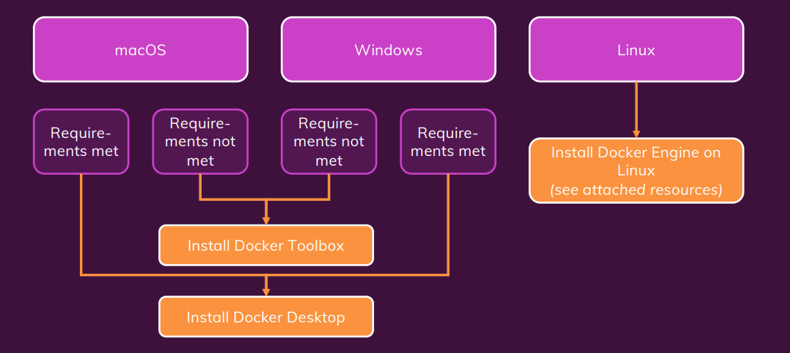

# Docker 

### Topics that i will try to cover in this documentation

- [Section 1: Getting Started ](#section-1-getting-started)

## Getting started

### What is Docker?
[Docker](https://docs.docker.com/) is a platform designed to help developers build, share, and run container applications.
In simple word Docker is a container technology or A tool for creating and managing containers

  

### Why Dockers?
Imagine you're developing a Node.js application using version 20.02. On your local machine, everything works perfectly because all the dependencies are compatible with this version of Node.js.

Now, you want to share your project with a friend who also wants to run it on their computer. However, your friend is using Node.js version 18.04. When they try to install the project's dependencies, they encounter errors because some of the dependencies are not compatible with Node.js 18.04. You suggest that they upgrade to Node.js version 20.02, but this introduces the hassle of setting up the right environment just to get the project running.

This is where Docker comes in. With Docker, you can package your application, along with all its dependencies, libraries, and the specific version of Node.js you’re using, into a container. You can then share this container with anyone, and they will be able to run your project without having to manually set up the same environment on their machine. Docker ensures that your software runs the same, regardless of where it's deployed.

### What is a Virtual Machine (VM)?

A Virtual Machine (VM) is a software-based emulation of a physical computer that runs its own operating system and applications. It behaves like a separate computer, even though it runs on top of an existing host system.

### Docker vs Virtual Machines (VMs) – Brief Summary

| Feature           | Docker                             | Virtual Machines (VMs)                  |
|-------------------|------------------------------------|-----------------------------------------|
| **Architecture**   | Containers share the host OS and are lightweight | Each VM runs a full guest OS, making them heavier |
| **Resource Usage** | Uses fewer resources (CPU, memory, storage) | Requires more resources due to full OS overhead |
| **Performance**    | Faster startup with minimal overhead | Slower startup and higher overhead |
| **Portability**    | Highly portable across Docker environments | Portable but more cumbersome with full OS |
| **Isolation**      | Provides process-level isolation | Stronger isolation by running separate OSes |
| **Use Cases**      | Best for scalable, cloud-native apps and microservices | Ideal for running multiple OSes or legacy apps |

For more understand

  

### Docker Engine Local Setup

To set up Docker Engine on your local PC, please follow the official Docker installation instructions for your operating system:

- **Ubuntu / Debian / Linux**: [Install Docker Engine on Ubuntu](https://docs.docker.com/engine/install/ubuntu/)
- **Windows**: [Install Docker Desktop on Windows](https://docs.docker.com/desktop/install/windows-install/)
- **macOS**: [Install Docker Desktop on macOS](https://docs.docker.com/desktop/install/mac-install/)

  

